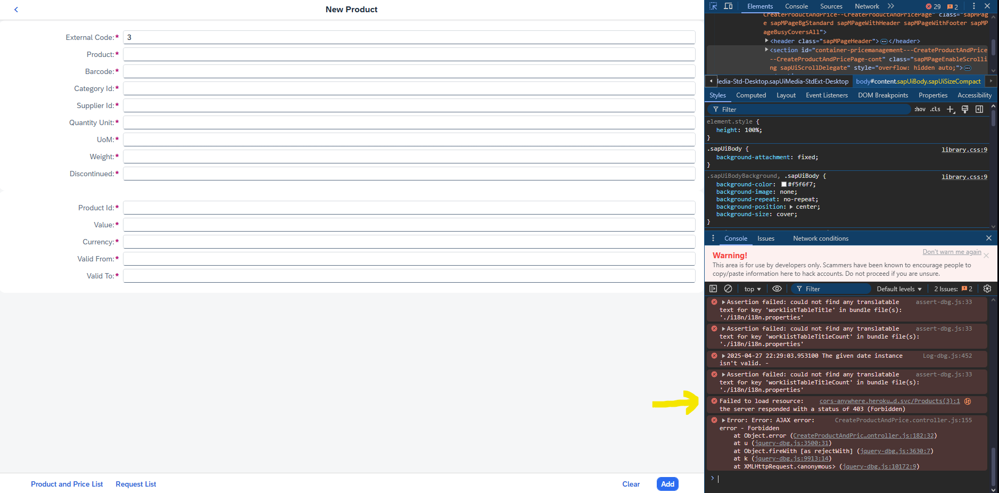
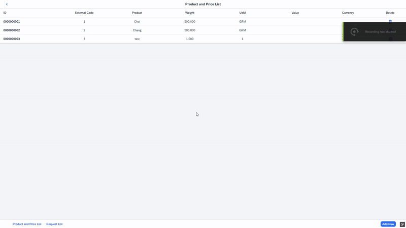
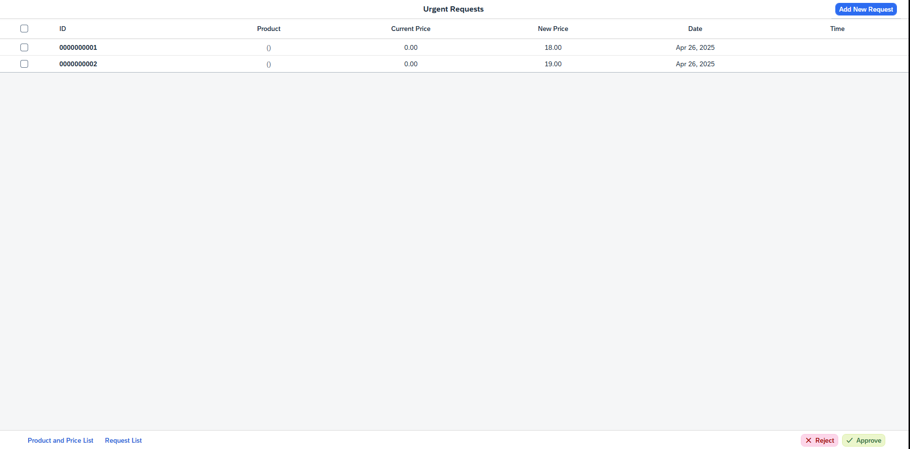
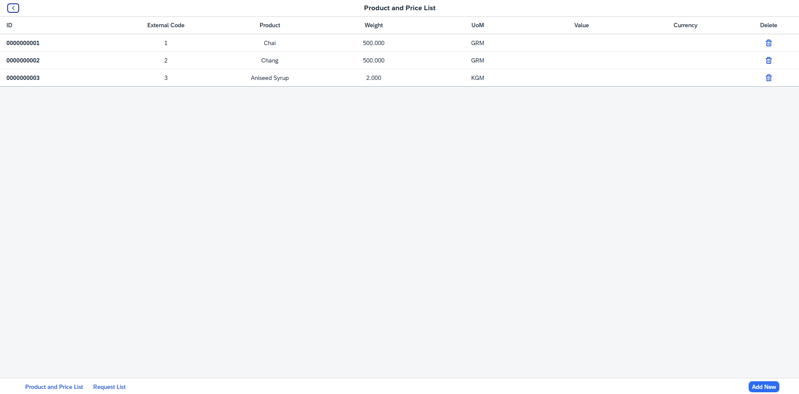

# Price Management
## (Last Update) - 27/04/2025
### This project was developed as a simple demonstration of a price management system integrating ABAP and a Fiori App frontend. It simulates a basic administration portal for handling product prices and monitoring price changes through an external API.

## Table of contents

- [Overview](#overview)
  - [The challenge](#the-challenge)
  - [Layout](#-layout)
  - [Links](#links)
- [My process](#my-process)
  - [Technologies](#-technologies)
  - [What I learned](#what-i-learned)
  - [Suggested Enhancements](#muscle-suggested-enhancements)
- [Author](#author)

## Overview

### The challenge

- [x] Create a simple CRUD for Products and Prices, allowing creation, reading, updating, and deleting records.
- [x] Build a Manager route where a user can accept or reject price changes fetched from an external API.
- [x] Allow products to be added either manually or imported based on the external API information.
- [x] Handle chained deletion — when deleting a product, its associated prices must be deleted first.
- [x] Retrieve and record metadata like creation date, time, and user in ABAP.

:thought_balloon: Noteworthy observations:

- The project is intentionally simple but demonstrates a complete CRUD flow and interaction with external data.
- The ABAP code uses concepts like package management, object associations, and structured error handling preparation, although some improvements are still needed.
- This app has been generated using the SAP Fiori tools - App Generator, as part of the SAP Fiori tools suite.  In order to launch the generated app, simply run the following from the generated app root folder:

```
    npm start
```

- Handling CORS manually by requesting temporary API access:
  - Open the browser console (F12).
  - In the Network tab, or by clicking on the "Forbidden" error message, navigate to [CORS Anywhere](https://cors-anywhere.herokuapp.com/corsdemo).
  - Click the **Request temporary access** button to unlock API usage.

<div align="center">
    <p>Request access:</p>
    
    
</div>

### 🔖 Layout

<div align="center">
    <p>Preview:</p>
    
</div>

<div align="center">
    <p>Manager Screen Example:</p>
    
</div>

<div align="center">
    <p>Product CRUD Screen Example:</p>
    
</div>

### Links

- Solution URL: [GitHub Repo](https://github.com/yourgithub/price-management-project)
- Live Site URL: (Deployment not available yet)

## My process

### 🚀 Technologies

- ABAP (via SAP GUI)
- Fiori.js
- Node.js

### What I learned

- Creating CRUD operations on both ABAP backend and Fiori frontend, maintaining the synchronization between them.

- Working with ABAPGit to generate a Zip archive that packages the entire development (`ZPRICE_MGMT`) for easy installation.

- Using ABAP functions to capture important metadata such as date, user and latest table Id:
```abap
  method REQUESTSET_CREATE_ENTITY.
    DATA: ls_request TYPE ztb_request.

    io_data_provider->read_entry_data(
        IMPORTING
            es_data = er_entity
    ).

    MOVE-CORRESPONDING er_entity TO ls_request.

    SELECT MAX( id ) FROM ztb_request INTO @DATA(lv_index).
    ls_request-id = lv_index + 1.
    ls_request-request_date = sy-datum.
    ls_request-request_time = sy-uzeit.

    INSERT ztb_request FROM ls_request.
  ENDMETHOD.
```

- Designing a delete operation where prices are deleted first, and then the product, ensuring database consistency:

```abap
  method PRICESET_DELETE_ENTITY.
    DATA: lv_id TYPE ztb_price-id.

    LOOP AT it_key_tab INTO DATA(ls_key).
        IF ls_key-name = 'Id'.
            lv_id = ls_key-value.
            EXIT.
        ENDIF.
    ENDLOOP.

    IF lv_id IS NOT INITIAL.
        DELETE FROM ztb_price WHERE product_id = lv_id.
    ENDIF.
  ENDMETHOD.
```

- Simple validation and handling multiple tables with a single form:

```js
    onSubmit: async function() {
        var oForm = this.getView().getModel("form");
        var oProductData = oForm.getProperty("/newProduct");
        var oPriceData = oForm.getProperty("/newPrice");
        console.log('Product: ', oProductData)
        console.log('Price: ', oPriceData)

        // Normalize data
        oProductData.Uom = oProductData.Uom.toUpperCase();
        oPriceData.Currency = oPriceData.Currency.toUpperCase();

        this.getView().setBusy(true); 

        ...
    }
```

- Elegant feedback using console logs and MessageToast popups:
```js
    onSubmit: async function() {
        ...
        console.log('📦 Product to update:', oProductData);
        console.log('💰 Price to update:', oPriceData);
        ...
        try {
            await this._updateProduct(oProductData);
            await this._updatePrice(oPriceData);
            MessageToast.show("Product and Price successfully updated!");
            this.onCancel(); // Clear fields
        } catch (error) {
            console.error("❌ Update error:", error);
            MessageToast.show("Update failed: " + error.message);
        } finally {
            this.getView().setBusy(false);
        }
    }
```


### :muscle: Suggested Enhancements:

- [ ] Implement a dynamic counter showing how many pending price change requests exist.

- [ ] Expand the product-price relationship to support historical pricing (currently not implemented).

- [ ] Improve error handling and transactional rollback for deletions and updates.

- [ ] Finalize association handling, making cross-entity references functional and visible in different apps.

- [ ] Enhance the Manager route by showing detailed price change history or comparison charts.

## Author

- GitHub - [bigodrigo](https://github.com/bigodrigo)
- Linkedin - [rodrigo-boquer](https://www.linkedin.com/in/rodrigo-boquer/)

**Generation Date and Time**: Wed Apr 16 2025 15:00:20 GMT-0300 (Brasilia Standard Time)<br>
**App Generator**: @sap/generator-fiori-freestyle<br>
**App Generator Version**: 1.17.0<br>
**Generation Platform**: Visual Studio Code<br>
**Template Used**: simple<br>
**Service Type**: SAP System (ABAP On Premise)<br>
**UI5 Theme**: sap_horizon<br>
**UI5 Version**: 1.108.0<br>
